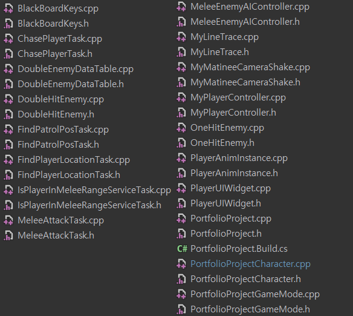
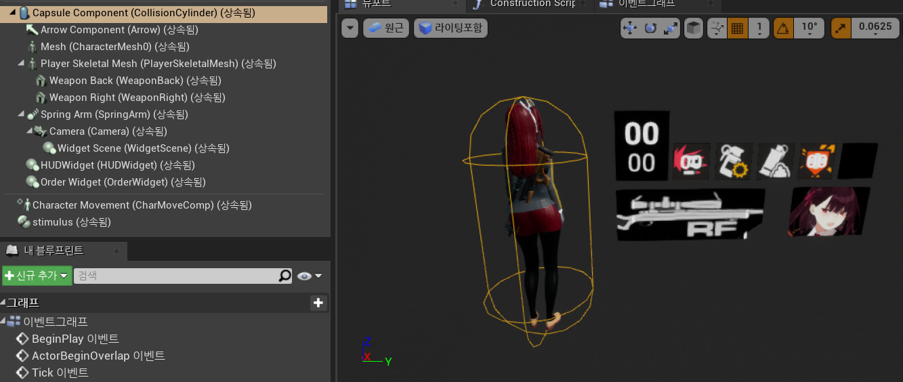
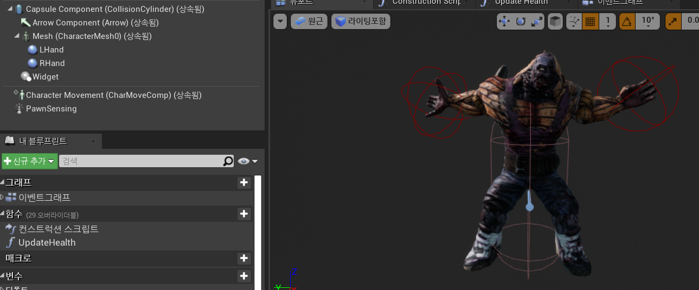
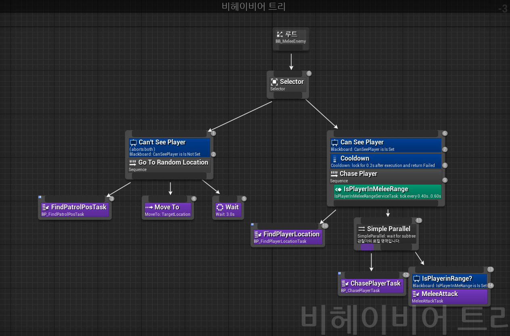
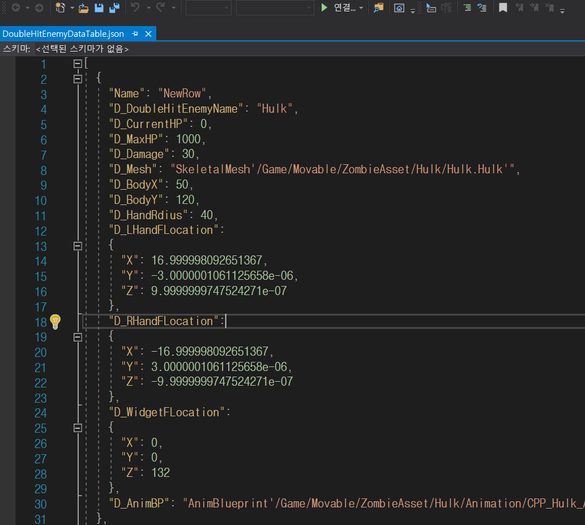

# UE4_ProjectZero
## 소개
TPS장르 미소녀 슈팅게임입니다.

언리얼엔진4와 C++을 사용하여 제작하고 있습니다.

## 코드 목록

* * *
### PortfolioProjectCharacter.cpp / 플레이어 캐릭터

* 3인칭 시점이며 기본적인 사격, 조준, 장전, 장비 착용, 장비 해제, 점프, 이동을 구현했습니다.

* Widget Component를 붙여 플레이어의 기본적인 스테이터스를 UI로 표현했습니다.

* * *
### DoubleHitEnemy.cpp / 몬스터 캐릭터

* 기본적인 이동, 달리기, 공격, 사망을 구현했습니다.

* 임의로 왼손 또는 오른손을 뻗어 공격하며 플레이어와 충돌시 대미지를 적용하도록 했습니다.

* * *
### MeleeEnemyAIController.cpp / 몬스터 AI 컨트롤러

* Perception을 추가했습니다.
* BT(비헤이비어트리)를 활용하였고 해당하는 Task들은 CPP로 구현했습니다.

* * *
### PlayerUIWidget.cpp / 플레이어 UI 애니메이션

* TMap컨테이너를 활용하여 Widget의 애니메이션을 저장했고 상황에 따라 해당하는 애니메이션이 호출되도록 구현했습니다.

* * *
### MyLineTrace.cpp / 사격시 라인트레이싱

* 머리를 피격당할 경우 추가 대미지가 적용됩니다.

* 대상의 종류에 따라 피격 이펙트를 다르게 하였습니다.

* * *
### DoubleEnemyDataTable.h / 몬스터 테이블

* json파일로 몬스터를 추가하거나 에디터상에서 추가할 수 있습니다.
* 몬스터가 필드위에 생성이 될때 해당하는 몬스터의 이름값을 받아 정보를 불러오는 방식입니다.
